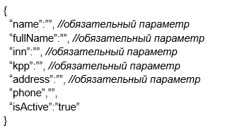
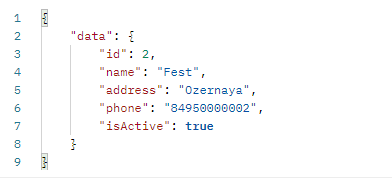

# Bell Integrator
Запуск приложения: practice-0.0.1-SNAPSHOT.jar

## Требования к проекту:
* Все возвращаемые типы данных находятся в параметре data
* В случае ошибки возвращается парметр error
* Везде, где не написан метод, использовать POST.

Например, в случае, если запрос корректно отработает:</br>
```
{
  "data":{
    //то, что в параметре out
  }
}
```
А в случае ошибки возвращает: 
```
{
"error":"текст ошибки"
}
```
## Инструкция:
1. Для получения списка организаций:</br>
http://localhost:8080/api/organization/list
   </br>In:</br>

   </br>Пример:</br>

   </br>Out:</br>

   </br>Пример:</br>


2. Для получения организации по id(метод GET):</br>
http://localhost:8080/api/organization/{id}
   </br>Out:</br>

   </br>Пример:</br>


   
3. Для сохранения новой организации:</br>
http://localhost:8080/api/organization/save
   </br>In:</br>

   </br>Пример:</br>

   </br>Out:</br>


4. Для изменения организации:</br>
   http://localhost:8080/api/organization/update
   </br>In:</br>
   
   </br>Пример:</br>
   
   </br>Out:</br>
   


5. Для получения списка офисов:</br>
   http://localhost:8080/api/office/list
   </br>
   In:</br>
   
   </br>Пример:</br>
   
   </br>Out:</br>
   
   </br>Пример:</br>
   


6. Для получения офиса по id(метод GET):</br>
   http://localhost:8080/api/office/{id}
   </br>Out:</br>
   
   </br>Пример:</br>
   


7. Для сохранения нового офиса:</br>
   http://localhost:8080/api/office/save
   </br>In:</br>
   
   </br>Пример:</br>
   
   </br>Out:</br>
   


8. Для изменения офиса:</br>
   http://localhost:8080/api/office/update
   </br>In:</br>
   
   </br>Пример:</br>
   
   </br>Out:</br>
    


9. Для получения списка сотрудников:</br>
   http://localhost:8080/api/user/list
   </br>
   In:</br>
   
   </br>Пример:</br>
   
   </br>Out:</br>
  
   </br>Пример:</br>
  


10. Для получения сотрудника по id(метод GET):</br>
   http://localhost:8080/api/user/{id}
   </br>Out:</br>
   
   </br>Пример:</br>
  


11. Для сохранения нового сотрудника:</br>
   http://localhost:8080/api/user/save
   </br>In:</br>
   
   </br>Пример:</br>
  
   </br>Out:</br>
   


12. Для изменения сотрудника:</br>
   http://localhost:8080/api/user/update
   </br>In:</br>
  
   </br>Пример:</br>
   
   </br>Out:</br>
   

###Справочники

1. Справочник документов:</br>
    http://localhost:8080/api/docs
    </br>Out:</br>
    


3. Справочник стран:</br>
    http://localhost:8080/api/countries
    </br>Out:</br>
    


###При возникновении ошибки:
   Пример out:</br>
   

Описание ошибки можно найти по номеру в логах. 
